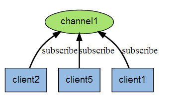
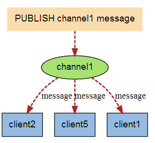

# Redis其它功能


# Redis发布订阅

## 简介

Redis 发布订阅(pub/sub)是一种消息通信模式：发送者(pub)发送消息，订阅者(sub)接收消息。
Redis 客户端可以订阅任意数量的频道。


```
Redis 发布订阅(pub/sub)是一种消息通信模式：发送者(pub)发送消息，订阅者(sub)接收消息。
Redis 客户端可以订阅任意数量的频道。
下图展示了频道 channel1 ， 以及订阅这个频道的三个客户端 —— client2 、 client5 和 client1 之间的关系
```

 

```
当有新消息通过 PUBLISH 命令发送给频道 channel1 时， 这个消息就会被发送给订阅它的三个客户端：
```

 

配置订阅和发布

## 常用命令

```properties
订阅频道：
	SUBSCRIBE channel [channel ...] :订阅给定的一个或多个频道的信息
	PSUBSCRIBE pattern [pattern ...] :订阅一个或多个符合给定模式的频道。
	
发布频道：
	PUBLISH channel message :将信息发送到指定的频道。
	
退订频道：
	UNSUBSCRIBE [channel [channel ...]] :指退订给定的频道。
	PUNSUBSCRIBE [pattern [pattern ...]]:退订所有给定模式的频道。

```

## 应用场景

> 这一功能最明显的用法就是构建实时消息系统，比如普通的即时聊天，群聊等功能
> 1在一个博客网站中，有100个粉丝订阅了你，当你发布新文章，就可以推送消息给粉丝们。
> 2微信公众号模式
>
> **微博**，每个用户的粉丝都是该用户的订阅者，当用户发完微博，所有粉丝都将收到他的动态；
>
> **新闻**，资讯站点通常有多个频道，每个频道就是一个主题，用户可以通过主题来做订阅(如RSS)，这样当新闻发布时，订阅者可以获得更新
>
> 简单的应用场景的话, 以门户网站为例, 当编辑更新了某推荐板块的内容后:
>
> 1. CMS发布清除缓存的消息到channel (推送者推送消息)
> 2. 门户网站的缓存系统通过channel收到清除缓存的消息 (订阅者收到消息)，更新了推荐板块的缓存
> 3. 还可以做集中配置中心管理，当配置信息发生更改后，订阅配置信息的节点都可以收到通知消息


# Redis多数据库

Redis下，数据库是由一个整数索引标识，而不是由一个数据库名称。默认情况下，一个客户端连接到数据库0。

**redis配置文件中下面的参数来控制数据库总数：**
    database 16  //(从0开始 1 2 3 …15)

**select 数据库//数据库的切换** 

**移动数据（将当前key移动另个库)**

```
move key名称   数据库
```

**数据库清空：**

```properties
flushdb  :清除当前数据库的所有key
flushall :清除整个Redis的数据库所有key
```


# Redis事务

Redis 事务可以一次执行多个命令，（按顺序地串行化执行，执行中不会被其它命令插入，不许加塞）

## 简介

Redis 事务可以一次执行多个命令（允许在一次单独的步骤中执行一组命令）， 并且带有以下两个重要的保证：

> 批量操作在发送 EXEC 命令前被放入队列缓存。
> 收到 EXEC 命令后进入事务执行，事务中任意命令执行失败，其余的命令依然被执行。
> 在事务执行过程，其他客户端提交的命令请求不会插入到事务执行命令序列中。

1. **Redis会将一个事务中的所有命令序列化，然后按顺序执行**
2. **执行中不会被其它命令插入，不许出现加赛行为**


## 常用命令

```properties
DISCARD
	:取消事务，放弃执行事务块内的所有命令。
EXEC
	:执行所有事务块内的命令。
	
MULTI
	:标记一个事务块的开始。	

UNWATCH
	:取消 WATCH 命令对所有 key 的监视。
	
WATCH key [key ...]
	:监视一个(或多个) key ，如果在事务执行之前这个(或这些) key 被其他命令所改动，那么事务将被打断。	
```


**一个事务从开始到执行会经历以下三个阶段：**

开始事务。

命令入队。

执行事务。


## 示例1 MULTI EXEC

**转帐功能，A向B帐号转帐50元**
一个事务的例子，它先以 MULTI 开始一个事务，然后将多个命令入队到事务中，最后由 EXEC 命令触发事务


**1输入Multi命令开始，输入的命令都会依次进入命令队列中，但不会执行**
**2直到输入Exec后，Redis会将之前的命令队列中的命令依次执行**


## 示例2 DISCARD放弃队列运行


1输入Multi命令开始，输入的命令都会依次进入命令队列中，但不会执行
2直到输入Exec后，Redis会将之前的命令队列中的命令依次执行。
3命令队列的过程中可以通过discard来放弃队列运行


## 示例3事务的错误处理

事务的错误处理：
如果执行的某个命令报出了错误，则只有报错的命令不会被执行，而其它的命令都会执行，不会回滚。


## 示例4事务的错误处理

事务的错误处理：
**队列中的某个命令出现了报告错误，执行时整个的所有队列都会被取消。**


**由于之前的错误，事务执行失败**


## 示例5事务的WATCH

```properties
WATCH key [key ...] 
:监视一个(或多个) key ，如果在事务执行之前这个(或这些) key 被其他命令所改动，那么事务将被打断。
```

需求：某一帐户在一事务内进行操作，在提交事务前，另一个进程对该帐户进行操作。


## 应用场景

一组命令必须同时都执行，或者都不执行。
我们想要保证一组命令在执行的过程之中不被其它命令插入。

## 案例


# Redis数据淘汰策略redis.conf

Redis官方给的警告，当内存不足时，Redis会根据配置的缓存策略淘汰部分Keys，以保证写入成功。当无淘汰策略时或没有找到适合淘汰的Key时，Redis直接返回out of memory错误。

最大缓存配置
在redis中，允许用户设置最大使用内存大小
maxmemory  512G

> **redis提供8种数据淘汰策略：**
> •	volatile-lru：从已设置过期时间的数据集中挑选最近最少使用的数据淘汰
> •	volatile-lfu：从已设置过期的Keys中，删除一段时间内使用次数最少使用的
> •	volatile-ttl：从已设置过期时间的数据集中挑选最近将要过期的数据淘汰
> •	volatile-random：从已设置过期时间的数据集中随机选择数据淘汰
> •	allkeys-lru：从数据集中挑选最近最少使用的数据淘汰
> •	allkeys-lfu：从所有Keys中，删除一段时间内使用次数最少使用的
> •	allkeys-random：从数据集中随机选择数据淘汰
> •	no-enviction（驱逐）：禁止驱逐数据(不采用任何淘汰策略。默认即为此配置),针对写操作，返回错误信息

建议：了解了Redis的淘汰策略之后，在平时使用时应尽量主动设置/更新key的expire时间，主动剔除不活跃的旧数据，有助于提升查询性能


# Redis持久化

**什么是Redis持久化？**
持久化就是把内存的数据写到磁盘中去，防止服务宕机了内存数据丢失。
Redis 提供了两种持久化方式:RDB（默认）和AOF

## 简介

**数据存放于：**

**内存：高效、断电（关机）内存数据会丢失**

**硬盘：读写速度慢于内存，断电数据不会丢失**

```
Redis持久化存储支持两种方式：RDB和AOF。RDB一定时间取存储文件，AOF默认每秒去存储历史命令，
Redis是支持持久化的内存数据库，也就是说redis需要经常将内存中的数据同步到硬盘来保证持久化。
```

## RDB

rdb是Redis DataBase缩写
功能核心函数rdbSave(生成RDB文件)和rdbLoad（从文件加载内存）两个函数


RDB：是redis的默认持久化机制。
快照是默认的持久化方式。这种方式是就是将内存中数据以快照的方式写入到二进制文件中,默认的文件名为	dump.rdb。

**优点：**
快照保存数据极快、还原数据极快
适用于灾难备份
**缺点：**小内存机器不适合使用,RDB机制符合要求就会照快照

**快照条件：**

```
1、服务器正常关闭时  ./bin/redis-cli shutdown
2、key满足一定条件，会进行快照 
 vim redis.conf搜索save
       :/save
      save 900 1     //每900秒（15分钟）至少1个key发生变化，产生快照
      save 300 10   //每300秒（5分钟）至少10个key发生变化，产生快照
      save 60 10000   //每60秒（1分钟）至少10000个key发生变化，产生快照
```


## AOF

由于快照方式是在一定间隔时间做一次的，所以如果redis意外down 掉的话，就会丢失最后一次快照后的所有修改。如果应用要求不能丢失任何修改的话，可以采用aof持久化方式。

Append-only file:aof 比快照方式有更好的持久化性，是由于在使用aof持久化方式时,redis会将每一个收到的写命令都通过write 函数追加到文件中(默认是appendonly.aof)。当redis重启时会通过重新执行文件中保存的写命令来在内存中重建整个数据库的内容。


**每当执行服务器(定时)任务或者函数时flushAppendOnlyFile函数都会被调用，这个函数执行以下两个工作**
**aof写入保存：**
WRITE：根据条件，将aof_buf中的缓存写入到 AOF 文件
SAVE：根据条件，调用fsync或fdatasync函数，将 AOF 文件保存到磁盘中。

**有三种方式如下（默认是：每秒fsync一次）**
•	appendonly yes //启用aof持久化方式
•	# appendfsync always //收到写命令就立即写入磁盘，最慢，但是保证完全的持久化
•	appendfsynceverysec //每秒钟写入磁盘一次，在性能和持久化方面做了很好的折中
•	# appendfsync no //完全依赖os，性能最好,持久化保证

**产生的问题：**
 aof的方式也同时带来了另一个问题。持久化文件会变的越来越大。例如我们调用incr test命令 100 次，文件中必须保存全部的 100 条命令，其实有 99 条都是多余的。


# Redis缓存与数据库一致性

##  一、实时同步

对强一致要求比较高的，应采用实时同步方案，即查询缓存查询不到再从DB查询，保存到缓存；更新缓存时，先更新数据库，再将缓存的设置过期(建议不要去更新缓存内容，直接设置缓存过期)。
@Cacheable：查询时使用，注意Long类型需转换为Sting类型，否则会抛异常
@CachePut：更新时使用，使用此注解，一定会从DB上查询数据
@CacheEvict：删除时使用；
@Caching：组合用法     


## 二、异步队列

对于并发程度较高的，可采用异步队列的方式同步，可采用kafka/RabbitMQ等消息中间件处理消息生产和消费。

## 三、使阿里的同步工具canal


## 四、采用UDF自定义函数的方式

面对mysql的API进行编程，利用触发器进行缓存同步，但UDF主要是c/c++语言实现，学习成本高。


# 总结

## 穿透

**缓存穿透是指查询一个一定不存在的数据，由于缓存是不命中时需要从数据库查询，查不到数据则不写入缓存，这将导致这个不存在的数据每次请求都要到数据库去查询，造成缓存穿透。**

**解决办法：** 

​      持久层查询不到就缓存空结果，查询时先判断缓存中是否exists(key) ,如果有直接返回空，没有则查询后返回，
注意insert时需清除查询的key，否则即便DB中有值也查询不到(当然也可以设置空缓存的过期时间）

​		1、不管数据实际上存不存在，我们都把这个键存到缓存中（有效期设置的短一些，比如一分钟到三分钟），然后值设置为一个特定值，业务中如果获取到的结果是这个特定值，则报错返回。

​		2、是使用 redis 的布隆过滤器（Bloom Filter），将所有可能存在的数据哈希到一个足够大的bitmap中，一个一定不存在的数据会被 这个bitmap拦截掉，从而避免了对底层存储系统的查询压力。

##  **雪崩**

**雪崩：缓存大量失效的时候，引发大量查询数据库。**

**解决办法：**

​    用锁/分布式锁或者队列串行访问
​	缓存失效时间均匀分布

```
如果缓存集中在一段时间内失效，发生大量的缓存穿透，所有的查询都落在数据库上，造成了缓存雪崩。

这个没有完美解决办法，但可以分析用户行为，尽量让失效时间点均匀分布。大多数系统设计者考虑用加锁或者队列的方式保证缓存的单线程（进程）写，从而避免失效时大量的并发请求落到底层存储系统上。
```


**1 加锁排队. 限流-- 限流算法.**

 在缓存失效后，通过加锁或者队列来控制读数据库写缓存的线程数量。比如对某个key只允许一个线程查询数据和写缓存，其他线程等待。

简单地来说，就是在缓存失效的时候（判断拿出来的值为空），不是立即去load db，而是先使用缓存工具的某些带成功操作返回值的操作（比如[Redis](http://lib.csdn.net/base/redis)的SETNX或者Memcache的ADD）去set一个mutex key，当操作返回成功时，再进行load db的操作并回设缓存；否则，就重试整个get缓存的方法。

SETNX，是「SET if Not eXists」的缩写，也就是只有不存在的时候才设置，可以利用它来实现锁的效果。

**2 数据预热**

  可以通过缓存reload机制，预先去更新缓存，再即将发生大并发访问前手动触发加载缓存不同的key，设置不同的过期时间，让缓存失效的时间点尽量均匀


## 热点key(缓存击穿)

**热点key:某个key访问非常频繁，当key失效的时候有大量线程来构建缓存，导致负载增加，系统崩溃。**

```bat
缓存击穿是指一个Key非常热点，在不停的扛着大并发，大并发集中对这一个点进行访问，当这个Key在失效的瞬间，持续的大并发就穿破缓存，直接请求到数据库，这时，大并发量可能直接将数据库给挂掉。
```

**解决办法：**

1 使用锁，单机用synchronized,lock等，分布式用分布式锁。

2 缓存过期时间不设置，而是设置在key对应的value里。如果检测到存的时间超过过期时间则异步更新缓存。

3在value设置一个比过期时间t0小的过期时间值t1，当t1过期的时候，延长t1并做更新缓存操作。

4设置标签缓存，标签缓存设置过期时间，标签缓存过期后，需异步地更新实际缓存 


## 案例

```
假设并发有10000个请求，想达到第一次请求从数据库中获取，其他9999个请求从redis中获取这种效果
```

```
public synchroinzed selectbyId(String id){
    if(key.exists(key)){
       redis
    }else{
      mysql
       redis.set("..",val);
    }

```


通过测试，发现有大量请求进行查询数据库~~

### 解决方案：

#### 方法1：

```properties
public synchronized  User selectById(String id)  :synchronized
```

```
使用互斥锁排队
业界比价普遍的一种做法，即根据key获取value值为空时，锁上，从数据库中load数据后再释放锁。若其它线程获取锁失败，则等待一段时间后重试。这里要注意，分布式环境中要使用分布式锁，单机的话用普通的锁（synchronized、Lock）就够了。
```

#### 方法2：

双重检测锁压测

