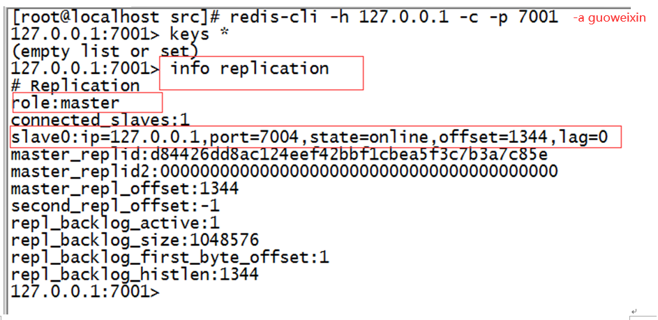
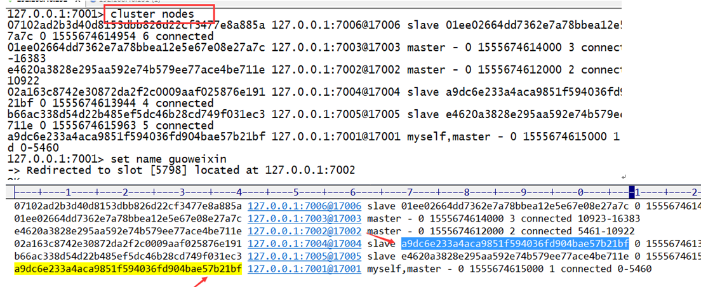
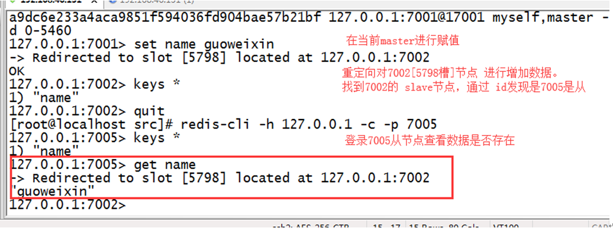

# Redis高级配置

# 一  可能的问题

一般来说，要将Redis运用于工程项目中，只使用一台Redis是万万不能的，原因如下：

​    1、从结构上，单个Redis服务器会发生单点故障，并且一台服务器需要处理所有的请求负载，压力较大；(容错性)

​     2、从容量上，单个Redis服务器内存容量有限，就算一台Redis服务器内容容量为256G，也不能将所有内容用作Redis存储内存，一般来说，单台Redis最大使用内存不应该超过**20G**。


**问题：**

1、内存容量有限 2、处理能力有限 3、无法高可用。


# 基本概述

## 高可用

“高可用性”（High Availability）通常来描述一个系统经过专门的设计，从而减少停工时间，而保持其服务的高度可用性。(一直都能用)   

高可用：6个9  99.9999%  全年停机不超过32秒。

## 高并发

**高并发**（High Concurrency）是互联网分布式系统架构设计中必须考虑的因素之一，它通常是指，通过设计保证系统能够同时并行处理很多请求。

​	高并发相关常用的一些指标有响应时间（Response Time），吞吐量（Throughput），每秒查询率QPS（Query Per Second），并发用户数等。

> **响应时间：**系统对请求做出响应的时间。例如系统处理一个HTTP请求需要200ms，这个200ms就是系统的响应时间。
>
> **吞吐量：**单位时间内处理的请求数量。
>
> **QPS**：每秒响应请求数。在互联网领域，这个指标和吞吐量区分的没有这么明显。
> 并发用户数：同时承载正常使用系统功能的用户数量。例如一个即时通讯系统，同时在线量一定程度上代表了系统的并发用户数。

### 提升系统的并发能力

提高系统并发能力的方式，方法论上主要有两种：垂直扩展（Scale Up）与水平扩展（Scale Out）。
#### 垂直扩展

垂直扩展：提升单机处理能力。垂直扩展的方式又有两种：
（1）增强单机硬件性能，例如：增加CPU核数如32核，升级更好的网卡如万兆，升级更好的硬盘如SSD，扩充硬盘容量如2T，扩充系统内存如128G；
（2）提升单机架构性能，例如：使用Cache来减少IO次数，使用异步来增加单服务吞吐量，使用无锁数据结构来减少响应时间；

在互联网业务发展非常迅猛的早期，如果预算不是问题，强烈建议使用“增强单机硬件性能”的方式提升系统并发能力，因为这个阶段，公司的战略往往是发展业务抢时间，而“增强单机硬件性能”往往是最快的方法。

总结：不管是提升单机硬件性能，还是提升单机架构性能，都有一个致命的不足：单机性能总是有极限的。所以互联网分布式架构设计高并发终极解决方案还是水平扩展。
#### 水平扩展

水平扩展：只要增加服务器数量，就能线性扩充系统性能。水平扩展对系统架构设计是有要求的，难点在于：如何在架构各层进行可水平扩展的设计，

## 高性能

高性能（High Performance）就是指程序处理速度快，所占内存少，cpu低


# 二  主从复制


## 简介

应用场景：

```
电子商务网站上的商品，一般都是一次上传，无数次浏览的，说专业点也就是”多读少写”。 
```

**主从复制：** 
一个Redis服务可以有多个该服务的复制品，这个Redis服务称为Master，其它复制称为Slaves


如图中所示，我们将一台Redis服务器作主库(Matser)，其他三台作为从库(Slave)，主库只负责写数据，每次有数据更新都将更新的数据同步到它所有的从库，而从库只负责读数据。这样一来，就有了两个好处：
1.	**读写分离，**不仅可以提高服务器的负载能力，并且可以根据读请求的规模自由增加或者减少从库的数量。 
2.	**数据被复制成了了好几份**，就算有一台机器出现故障，也可以使用其他机器的数据快速恢复。
需要注意的是：在Redis主从模式中，一台主库可以拥有多个从库，但是一个从库只能隶属于一个主库。 


## Redis主从复制配置

**在Redis中，要实现主从复制架构非常简单，只需要在从数据库的配置文件中加上如下命令即可：**

1、主数据库不需要任务配置，创建一个从数据库：

redis.conf(配置文件信息)

```properties
-- port 6380  :从服务的端口号 
--slaveof 127.0.0.1 6379 :指定主服务器
```

2、启动从数据库：

```
./bin/redis-server ./redis.conf --port 6380 --slaveof 127.0.0.1 6379
```

 加上slaveof参数启动另一个Redis实例作为从库，并且监听6380端口


3、登录到从服务客户端：

```
./bin/redis-cli -p 6380 -a guoweixin
```


```
变回主： slaveof no one  //不是任何从
变回从： slaveofip地址   端口号
```


# 三 哨兵模式

## 简介

```
Redis-Sentinel（哨兵模式）是高可用解决方案，当redis在做master-slave的高可用方案时，假如master宕机了，redis本身（以及其很多客户端）都没有实现自动进行主备切换，而redis-sentinel本身也是独立运行的进程，可以部署在其他与redis集群可通讯的机器中监控redis集群。
```

```
有了主从复制的实现之后，我们如果想从服务器进行监控，那么在redis2.6以后提供了一个”哨兵“机制，并在2.8版本以后功能稳定起来。
哨兵：顾名思义，就是监控Redis系统的运行状况
```


心跳机制：太快/太慢/

哨兵模式的特点

```
1、不时地监控redis是否按照预期良好地运行;
2、如果发现某个redis节点运行出现状况，能够通知另外一个进程(例如它的客户端);
3、能够进行自动切换。当一个master节点不可用时，能够选举出master的多个slave(如果有超过一个slave的话)中的一个来作为新的master,其它的slave节点会将它所追随的master的地址改为被提升为master的slave的新地址。
4、哨兵为客户端提供服务发现，客户端链接哨兵，哨兵提供当前master的地址然后提供服务，如果出现切换，也就是master挂了，哨兵会提供客户端一个新地址。
```


# 四 Redis Cluster集群

## 简介

**集群模式是实际使用最多的模式。**

Redis Cluster是社区版推出的Redis分布式集群解决方案，主要解决Redis分布式方面的需求，比如，当遇到单机内存，并发和流量等瓶颈的时候，Redis Cluster能起到很好的负载均衡的目的。

**为什么使用redis-cluster？**

```
为了在大流量访问下提供稳定的业务，集群化是存储的必然形态
未来的发展趋势肯定是云计算和大数据的紧密结合 
只有分布式架构能满足要求
分布式：将一个业务部署在不同的服务器上。
```


## 集群描述

**Redis集群搭建方案：**

> （1）Twitter开发的twemproxy
>
> （2）豌豆荚开发的codis
>
> （3）**redis官方的redis-cluster**

Redis集群搭建的方式有多种，但从redis 3.0之后版本支持redis-cluster集群，**至少需要3(Master)+3(Slave)才能建立集群**。Redis-Cluster采用无中心结构，每个节点保存数据和整个集群状态,每个节点都和其他所有
节点连接。其redis-cluster架构图如如下侧：


Redis Cluster集群节点最小配置6个节点以上（3主3从），其中主节点提供增删改操作，从节点作为（读）备用节点，不提供请求，只作为故障转移使用。


## Redis Cluster集群特点


1、所有的redis节点彼此互联(PING-PONG机制),内部使用二进制协议优化传输速度和带宽。
2、节点的fail是通过集群中超过半数的节点检测失效时才生效。
3、客户端与redis节点直连,不需要中间proxy层.客户端不需要连接集群所有节点,连接集群中任何一个可用节点即可。
4、redis-cluster把所有的物理节点映射到[0-16383]slot上（不一定是平均分配）,cluster 负责维护 

5、Redis集群预分好16384个哈希槽，当需要在 Redis 集群中放置一个 key-value 时， redis 先对key 使用 crc16 算法算出一个结果，然后把结果对 16384 求余数，这样每个 key 都会对应一个编号在 0-16383 之间的哈希槽，redis 会根据节点数量大致均等的将哈希槽映射到不同的节


## Redis Cluster容错

`容错性，是指软件检测应用程序所运行的软件或硬件中发生的错误并从错误中恢复的能力，通常可以从系统的可靠性、可用性、可测性等几个方面来衡量。`


**1什么时候判断master不可用？**

​	投票机制。投票过程是集群中所有master参与,如果半数以上master节点与master节点通信超时(cluster-node-timeout),认为当前master节点挂掉. 

**2什么时候整个集群不可用(cluster_state:fail)?** 
	如果集群任意master挂掉,且当前master没有slave.集群进入fail状态,也可以理解成集群的slot映射[0-16383]不完整时进入fail状态. 如果集群超过半数以上master挂掉，无论是否有slave，集群进入fail状态.


## Redis Cluster节点分配

​	Redis Cluster采用虚拟槽分区，所有的键根据哈希函数映射到0～16383个整数槽内，每个节点负责维护一部分槽以及槽所印映射的键值数据。

​	三个主节点分别是：A, B, C 三个节点，它们可以是一台机器上的三个端口，也可以是三台不同的服务器。那么，采用哈希槽 (hash slot)的方式来分配16384个slot 的话，它们三个节点分别承担的slot 区间是

```
	节点A覆盖0－5460;
	节点B覆盖5461－10922;
	节点C覆盖10923－16383
```


## Redis Cluster集群搭建

集群搭建参考官网：<https://redis.io/topics/cluster-tutorial>

​		redis集群需要至少要三个master节点，我们这里搭建三个master节点，并且给每个master再搭建一个slave节点，总共6个redis节点，这里用一台机器（可以多台机器部署，修改一下ip地址就可以了）部署6个redis实例，三主三从，搭建集群的步骤如下：

Redis 5.0以上版本

### **1、创建Redis节点安装目录**

```properties
mkdir -p /usr/local/redis_cluster  :指定目录下 创建 redis_cluster
```

### **2、在redis_cluster目录下，创建7000-7005个文件夹下**

```properties
mkdir 7000 7001 7002 7003 7004 7005
```

### **3、并将redis-conf分别拷贝到7000-7005文件夹下**

```properties
cp /opt/redis-5.0.4/redis.conf  ./7000
```

### **4.修改Redis配置文件**

**/usr/local/redis_cluster/7000/redis.conf**

```properties
# 关闭保护模式 用于公网访问
protected-mode no
port 7000
# 开启集群模式
cluster-enabled yes  
cluster-config-file nodes-7000.conf
cluster-node-timeout 5000
# 后台启动
daemonize yes
pidfile /var/run/redis_7000.pid
logfile "7000.log"
#dir /redis/data
# 此处绑定ip 可以是阿里内网ip 和 本地ip 也可以直接注释掉该项  
#bind 127.0.0.1    
#用于连接主节点密码
masterauth guoweixin
#设置redis密码 各个节点请保持密码一致
requirepass guoweixin
```

### **5、依次复制并修改 6个redis.conf**

```properties
cp ./7000/redis.conf  ./7001/    :依次进行复制
vim ./7001/redis.conf     :执行 %s/old/new/g  全部替换  :wq 保存并退出 即可
```

### 6、依次启动6个节点

将安装的redis 目录下的src 复制到  cluster下，方便启动服务端

```properties
cd /opt/redis-5.0.0    :进入redis安装目录
cp -r  ./src/ /usr/local/redis_cluster/    :将src文件复制到redis_cluster目录中
```

```bat
./src/redis-server ./7000/redis.conf 
./src/redis-server ./7001/redis.conf 
./src/redis-server ./7002/redis.conf 
./src/redis-server ./7003/redis.conf 
./src/redis-server ./7004/redis.conf 
./src/redis-server ./7005/redis.conf 
```

启动后，可以用PS查看进程：

```
ps -ef | grep  -i redis
```

### 7、创建集群

Redis 5版本后 通过redis-cli 客户端命令来创建集群。

```
./src/redis-cli --cluster  create  -a guoweixin 127.0.0.1:7000 127.0.0.1:7001 127.0.0.1:7002 127.0.0.1:7003 127.0.0.1:7004 127.0.0.1:7005 --cluster-replicas 1
```


## Redis Cluster集群验证

在某台机器上（或）连接集群的7001端口的节点：

```properties
 redis-cli -h 127.0.0.1  -c -p 7000 -a guoweixin  :加参数 -c 可连接到集群
```

redis cluster在设计的时候，就考虑到了去中心化，去中间件，也就是说，集群中的每个节点都是平等的关系，都是对等的，每个节点都保存各自的数据和整个集群的状态。每个节点都和其他所有节点连接，而且这些连接保持活跃，这样就保证了我们只需要连接集群中的任意一个节点，就可以获取到其他节点的数据

### 基本命令

**info replication**通过Cluster Nodes命令和Cluster Info命令来看看集群效果


###  输入命令 cluster nodes


​	每个Redis的节点都有一个ID值，此ID将被此特定redis实例永久使用，以便实例在集群上下文中具有唯一的名称。每个节点都会记住使用此ID的每个其他节点，而不是通过IP或端口。IP地址和端口可能会发生变化，但唯一的节点标识符在节点的整个生命周期内都不会改变。我们简单地称这个标识符为节点ID。


###  测试数据


## Redis Cluster总结

**简介：**

​	Redis cluster 为了保证数据的高可用性，加入了主从模式，一个主节点对应一个或多个从节点，主节点提供数据存取，从节点则是从主节点拉取数据备份，当这个主节点挂掉后，就会有这个从节点选取一个来充当主节点，从而保证集群不会挂掉。 

​	集群有ABC三个主节点, 如果这3个节点都没有加入从节点，如果B挂掉了，我们就无法访问整个集群了。A和C的slot也无法访问。 

​	所以我们在集群建立的时候，一定要为每个主节点都添加了从节点, 比如像这样, 集群包含主节点A、B、C, 以及从节点A1、B1、C1, 那么即使B挂掉系统也可以继续正确工作。

​	B1节点替代了B节点，所以Redis集群将会选择B1节点作为新的主节点，集群将会继续正确地提供服务。 当B重新开启后，它就会变成B1的从节点。 

不过需要注意，如果节点B和B1同时挂了，Redis集群就无法继续正确地提供服务了。 


# 五 Redis Cluster关闭集群

## 启动集群

**开启全部redis节点  redisall.sh**

```
/usr/local/redis_cluster/src/redis-server ./7000/redis.conf 
/usr/local/redis_cluster/src/redis-server ./7001/redis.conf 
/usr/local/redis_cluster/src/redis-server ./7002/redis.conf 
/usr/local/redis_cluster/src/redis-server ./7003/redis.conf 
/usr/local/redis_cluster/src/redis-server ./7004/redis.conf 
/usr/local/redis_cluster/src/redis-server ./7005/redis.conf 
```

```properties
chmod u+x redisall.sh    :执行将redisall.sh变成可执行文件
./redisall.sh  :在当前目录下启动： 
```

**启动集群**

vim startall.sh 追加如下内容：（记得改自己ip地址和密码）

```
/usr/local/redis_cluster/src/redis-cli --cluster  create  -a guoweixin 127.0.0.1:7000 127.0.0.1:7001 127.0.0.1:7002 127.0.0.1:7003 127.0.0.1:7004 127.0.0.1:7005 --cluster-replicas 1
```

```properties
 chmod u+x startall.sh    :执行将redisall.sh变成可执行文件
./startall.sh    :在当前目录下启动
```


## 关闭集群

**/usr/local/redis_cluster目录下编写脚本文件：vim shutdown.sh**

内容如下：

```sh
/usr/local/redis_cluster/src/redis-cli -c -h 127.0.0.1 -p 7000 -a guoweixin shutdown
/usr/local/redis_cluster/src/redis-cli -c -h 127.0.0.1 -p 7001 -a guoweixin shutdown
/usr/local/redis_cluster/src/redis-cli -c -h 127.0.0.1 -p 7002 -a guoweixin shutdown
/usr/local/redis_cluster/src/redis-cli -c -h 127.0.0.1 -p 7003 -a guoweixin shutdown
/usr/local/redis_cluster/src/redis-cli -c -h 127.0.0.1 -p 7004 -a guoweixin shutdown
/usr/local/redis_cluster/src/redis-cli -c -h 127.0.0.1 -p 7005 -a guoweixin shutdown
```

```properties
chmod u+x shutdown.sh   :然后执行将shutdown.sh变成可执行文件
 ./shutdown.sh   :在当前目录下启动
查看：ps aux|grep redis
官方：/usr/local/redis_cluster/redis-cli -a xxx -c -h 192.168.5.100 -p 8001
提示：-a访问服务端密码，-c表示集群模式，-h指定ip地址，-p指定端口号
```


# 六 Docker-Compose集群

​		redis集群需要至少要三个master节点，我们这里搭建三个master节点，并且给每个master再搭建一个slave节点，总共6个redis节点，这里用一台机器（可以多台机器部署，修改一下ip地址就可以了）部署6个redis实例，三主三从，搭建集群的步骤如下：

| 主      | 服务名称  | 端口号 | 从     | 服务名称  | 端口号 |
| ------- | --------- | ------ | ------ | --------- | ------ |
| master1 | 127.0.0.1 | 6381   | slave1 | 127.0.0.1 | 6384   |
| master1 | 127.0.0.1 | 6382   |        | 127.0.0.1 | 6385   |
| master1 | 127.0.0.1 | 6383   |        | 127.0.0.1 | 6386   |


### 1、创建Redis节点安装目录

```properties
 mkdir /opt/docker-redis-cluster
```

### 2、依次创建文件夹。并依次修改配置文件

```bat
创建文件夹 6381-6386
mkdir redis-6381

复制redis.conf到此目录下
cp redis.conf  /opt/docker-redis-cluster/redis-6381/
```

```bat
# 关闭保护模式 用于公网访问
protected-mode no
port 6381
# 开启集群模式
cluster-enabled yes  
#不改也可
#cluster-config-file nodes-6381.conf
#cluster-node-timeout 5000
# 日志文件
pidfile /var/run/redis_6381.pid
# 此处绑定ip 可以是阿里内网ip 和 本地ip 可以直接注释掉该项  
#bind 127.0.0.1    
#用于连接主节点密码
masterauth guoweixin
#设置redis密码 各个节点请保持密码一致
requirepass guoweixin
```

### 3、依次创建文件夹。并依次修改配置文件

按如上方式。修改6份。分别为 6381-6386。


### 4、编写docker-compose文件内容

```properties
version: '3'
services:
 redis-6381:
  container_name: redis-6381
  image: redis
  command: redis-server /etc/usr/local/redis.conf
  network_mode: "host"
  volumes:
   - /opt/docker-redis-cluster/redis-6381/redis.conf:/etc/usr/local/redis.conf
   - /opt/docker-redis-cluster/redis-6381/data:/data

 redis-6382:
  container_name: redis-6382
  image: redis
  command: redis-server /etc/usr/local/redis.conf
  network_mode: "host"
  volumes:
   - /opt/docker-redis-cluster/redis-6382/redis.conf:/etc/usr/local/redis.conf
   - /opt/docker-redis-cluster/redis-6382/data:/data

 redis-6383:
  container_name: redis-6383
  image: redis
  command: redis-server /etc/usr/local/redis.conf
  network_mode: "host"
  volumes:
   - /opt/docker-redis-cluster/redis-6383/redis.conf:/etc/usr/local/redis.conf
   - /opt/docker-redis-cluster/redis-6383/data:/data

 redis-6384:
  container_name: redis-6384
  image: redis
  command: redis-server /etc/usr/local/redis.conf
  network_mode: "host"
  volumes:
   - /opt/docker-redis-cluster/redis-6384/redis.conf:/etc/usr/local/redis.conf
   - /opt/docker-redis-cluster/redis-6384/data:/data

 redis-6385:
  container_name: redis-6385
  image: redis
  command: redis-server /etc/usr/local/redis.conf
  network_mode: "host"
  volumes:
   - /opt/docker-redis-cluster/redis-6385/redis.conf:/etc/usr/local/redis.conf
   - /opt/docker-redis-cluster/redis-6385/data:/data

 redis-6386:
  container_name: redis-6386
  image: redis
  command: redis-server /etc/usr/local/redis.conf
  network_mode: "host"
  volumes:
   - /opt/docker-redis-cluster/redis-6386/redis.conf:/etc/usr/local/redis.conf
   - /opt/docker-redis-cluster/redis-6386/data:/data
```

### 5、启动并测试

```bat
在/opt/docker-redis-cluster目录下 启动：
docker-compose up -d

查看是否全部启动成功。如未成功，需要排查错误（再执行下一步） 
docker-compose ps 

可通过远程工具连接任意一节点，看是否密码有效。
```

### 6、创建集群

Redis 5版本后 通过redis-cli 客户端命令来创建集群。

>  创建集群的命令
>
> --cluster  create  
>
> --cluster-replicas 1

```properties
docker exec -it redis-6381 redis-cli --cluster  create  -a guoweixin 127.0.0.1:6381 127.0.0.1:6382 127.0.0.1:6383 127.0.0.1:6384 127.0.0.1:6385 127.0.0.1:6386 --cluster-replicas 1

docker exec -it redis-6381 redis-cli --cluster  create  -a 123456 192.168.46.139:6381 192.168.46.139:6382 192.168.46.139:6383 192.168.46.139:6384 192.168.46.139:6385 192.168.46.139:6386 --cluster-replicas 1
```


### 7、Redis Cluster集群验证

在某台机器上（或）连接集群的6381端口的节点：

```properties
普通Redis方式：
  redis-cli -h 127.0.0.1  -c -p 6381 -a guoweixin  :加参数 -c 可连接到集群

Docker方式：
 docker exec -it redis-6381  redis-cli -h 127.0.0.1  -c -p 6381 -a guoweixin
```

redis cluster在设计的时候，就考虑到了去中心化，去中间件，也就是说，集群中的每个节点都是平等的关系，都是对等的，每个节点都保存各自的数据和整个集群的状态。每个节点都和其他所有节点连接，而且这些连接保持活跃，这样就保证了我们只需要连接集群中的任意一个节点，就可以获取到其他节点的数据

### 基本命令

**info replication**通过Cluster Nodes命令和Cluster Info命令来看看集群效果



### 输入命令 cluster nodes



​	每个Redis的节点都有一个ID值，此ID将被此特定redis实例永久使用，以便实例在集群上下文中具有唯一的名称。每个节点都会记住使用此ID的每个其他节点，而不是通过IP或端口。IP地址和端口可能会发生变化，但唯一的节点标识符在节点的整个生命周期内都不会改变。我们简单地称这个标识符为节点ID。


### 测试数据




# Centos防火墙端口

开放8080端口（如下命令只针对Centos7以上）

 查看已经开放的端口：

```
firewall-cmd --list-ports
```

开启端口:

```
firewall-cmd --zone=public --add-port=6379/tcp --permanent
```

重启防火墙:

```
firewall-cmd --reload #重启
firewall systemctl stop firewalld.service #停止
firewall systemctl disable firewalld.service #禁止firewall开机启动
```

